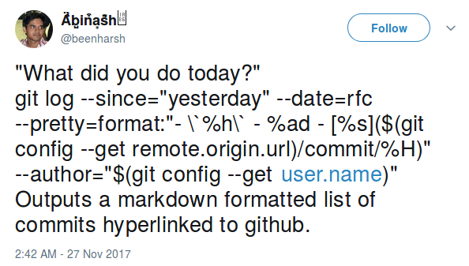

# Git Story

> A set of git repositories always tells a story; Find it!

## TOC

- [Introduction](#introduction)
- [Usage](#usage)
  - [gitstory](#gitstory)
  - [gitstory --config](#gitstory---config)
  - [gitstory_here](#gitstory_here)
- [Install](#install)
- [Attribution](#attribution)
- [License](#license)

## Introduction

Supply a root directory to this script, which has the following structure:

```sh
root_dir
|-> project_1
    |-> .git
    |-> project_file_1
    ...
|-> project_2
    |-> .git
    |-> project_file_2
    ...
```

This script will write to a file the list of commits that have been made in
these git repositories since a given time. See [Usage](#usage) for examples.

## Usage

### `gitstory`

#### Input

```sh
# to print the history of a list of repositories

$ ./gitstory [root_dir] [since]

$ ./gitstory ../work_stuff "January 2016"

$ ./gitstory ../academics "1 month"
```

#### Output

```sh
$ ./gitstory ../metakgp "Nov 2016"
Found 30 files under ../metakgp
Searching for commits from Nov 2016
Output goes to ./final_out_1513160141.final


gyft: 2017-12-02 - [check the dates input by user for sanity before generating timetable] [426ccec]
gyft: 2017-11-19 - [get working day period from dates and create appropriate events] [252163e]
gyft: 2017-11-19 - [supply duration of an event instead of supplying end date][6c04df3]
gyft: 2017-11-19 - [add the submodule that will return list of lists] [cf8296b]
gyft: 2017-12-05 - [change python to python3, add input/output option to readme][2f5b548]
gyft: 2017-12-05 - [Merge branch 'rohitner-fix-ics-io'] [f3b38e6]

metakgp-wiki: 2017-11-14 - [Merge pull request #27 from icyflame/icyflame/put-peqp-in-static] [ae89734]

mfqp: 2017-11-17 - [fix the sed commands for the new location of papers][a655100]
mfqp: 2017-11-17 - [change the base URL to static.metakgp.org] [7766596]
```

#### Options

`root_dir`

Default: Present directory

`since`

Default: yesterday

### `gitstory --config`

> You can put a config file consisting of paths to repositories that you want
> regular updates from.

Config file location: `$HOME/.gitstory_config`

#### Input

```sh
$ ./gitstory --config [since]

$ ./gitstory --config "last month"
```

#### Output

```sh
$ ./gitstory --config "last month"  
Found 2 files under /home/siddharth/.gitstory_config
Searching for commits from last month
Output goes to ./final_out_1513179251.final


mfqp: 2017-11-17 - [fix the sed commands for the new location of papers] [a655100]
mfqp: 2017-11-17 - [change the base URL to static.metakgp.org] [7766596]

mftp: 2017-11-23 - [remove unnecessary files for self sufficient version] [a7b5745]
mftp: 2017-11-23 - [add bootstrap, refresh page every 50 seconds] [e4fcf9e]
mftp: 2017-11-21 - [update.py in this branch can be used as a self-sufficient script] [21a1da0]
```

#### Options

`since`

Default: yesterday

### `gitstory_here`

#### Input

```sh
$ ./gitstory_here [since]

$ ./gitstory_here "1 week"

$ ./gitstory_here "last week"
```

#### Output

```sh
$ ./gitstory_here "last week" 
Found 12 files under ./gitstory
Searching for commits from last week
Output goes to ./here_out_1513160588.final


gitstory: 2017-12-13 - [change name and add appropriate shebang] [fb3d67a]
gitstory: 2017-12-12 - [if repo_name can't be inferred from remote URL, use folder name] [d64384a]
gitstory: 2017-12-11 - [add attrib to abinash's tweet] [f26603f]
gitstory: 2017-12-11 - [introduce debugging; make repository delimiting more consistent] [9891cf0]
gitstory: 2017-12-11 - [put newline between logs of different repos] [5bcdbec]
gitstory: 2017-12-11 - [ignore output files] [4bfaea5]
gitstory: 2017-12-11 - [initial commit] [09c11c4]
```

#### Options

`since`

Default: yesterday

## Install

Get the script and move it into a folder that's in the `$PATH`

```sh
# for gitstory
$ wget https://raw.githubusercontent.com/icyflame/gitstory/master/gitstory
$ chmod +x gitstory
$ mv gitstory /usr/local/bin

# gitstory_here
$ wget https://raw.githubusercontent.com/icyflame/gitstory/master/gitstory_here
$ chmod +x gitstory_here
$ mv gitstory_here /usr/local/bin
```

Note: The script
[`gitstory_here`](https://raw.githubusercontent.com/icyflame/gitstory/master/gitstory_here)
prints the list of commits in the given period for only the present git
repository. This script is useful if you only have one folder which you want to
track, on a regular basis (such as for a daily stand-up at work). (A git alias
can do the same thing, if you would prefer to not use a script)

## Attribution

The idea came from [Abinash's](https://github.com/abinashmeher999)
[tweet](https://twitter.com/beenharsh/status/935096376211279872)

[](https://twitter.com/beenharsh/status/935096376211279872)

## License

Code licensed under MIT

Copyright (C) 2017  Siddharth Kannan <kannan.siddharth12@gmail.com>
